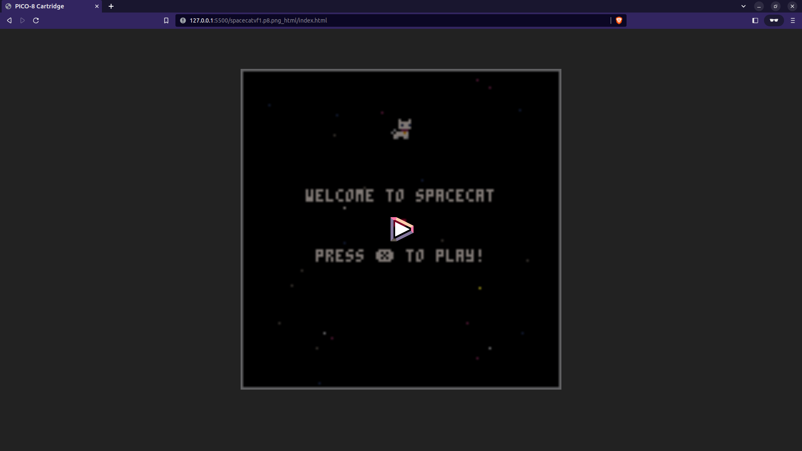
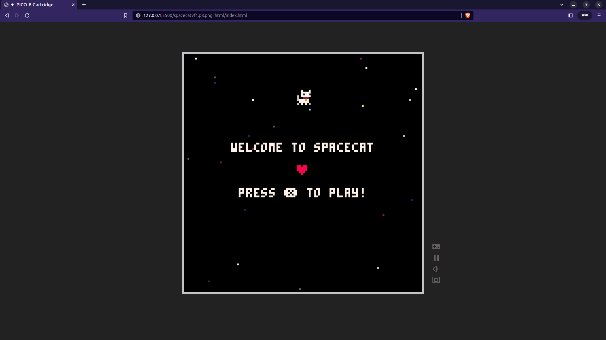
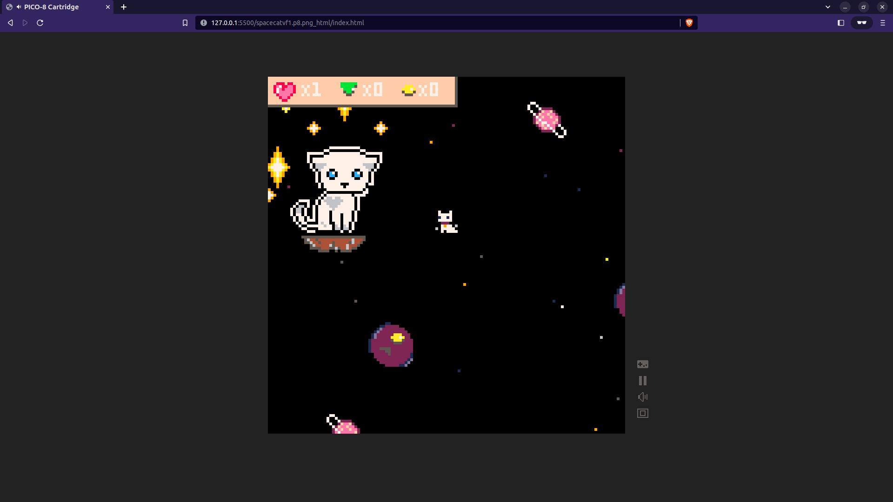
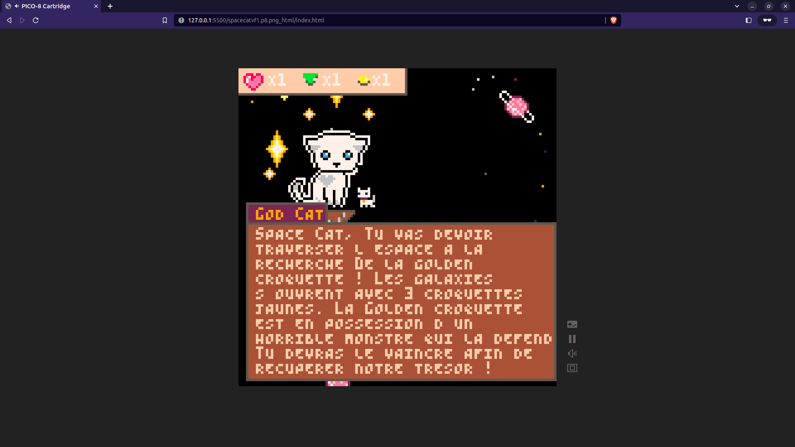
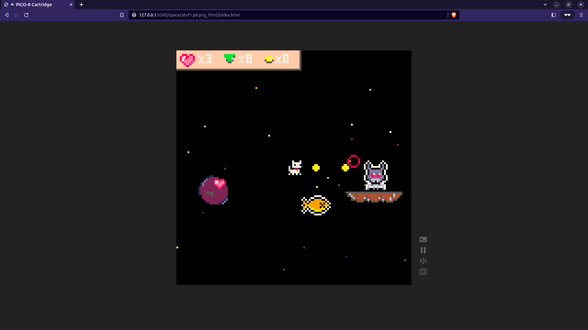

# Projet collectif Pico 8

Ce projet a été réalisé dans le cadre de notre formation dans le but de nous familiariser à la gestion de projet et à l'utilisation de l'outil Pico 8.

Après une session de brainstorming, nous avons décidé de partir sur un chat dans l'espace, oui c'est tout à fait normal !

Nous sommes heureux de partager avec vous quelques captures d'écran de notre projet final :

## Screenshots

## Descriptif

Nous avons codé directement dans l'interface de Pico 8, ce ne fut pas de tout repose mais nous sommes content d'avoir pu atteindre notre MVP.

En raison de contraintes de temps, nous avons pu développer uniquement quelques fonctionnalités. Il nous manque une vraie fin et un système de point de vie perdu avec un affichage pour le boss de fin, ainsi qu'un message de fin.

Je souhaite exprimer ma gratitude envers mes deux collègues qui ont contribué à la réalisation de ce projet.

[Malena Guallar](https://github.com/Malena-Guallar) et [Djihane B](https://github.com/DjihaneB)

